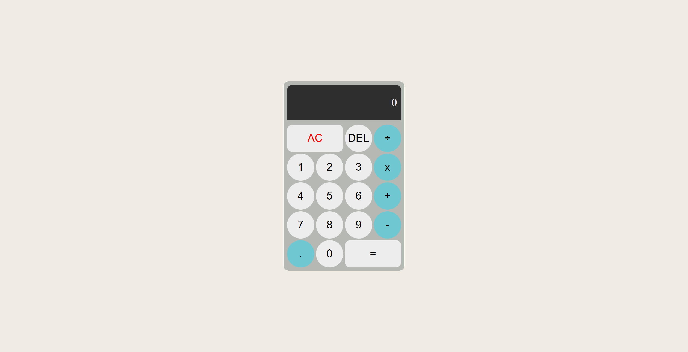

# Preview of the Calculator Application Project



## Check out the code

```javascript
import { useState } from 'react';
import './App.css';

function App() {
 const [calc, setCalc] = useState("");

 const operators = ['/', '*', '+', '-', '.'];

 const updateCalc = (value) => {
  if (
   (operators.includes(value) && calc === "") ||
   (operators.includes(value) && operators.includes(calc.slice(-1)))
  ) {
   return;
  }
  setCalc(calc + value);
 }

 const evaluate = () => {
  var operatorsInArray;
  var evaluation = 0;
  const containsOperator = operators.some(element => calc.includes(element)) // check if calculation has any operator

  if (containsOperator && !operators.includes(calc.slice(-1))) {

   var calcArrayWithOperators = calc.split(/([^.\d])+/);

   while (calcArrayWithOperators.includes("*") || calcArrayWithOperators.includes("/")) {
    if (calcArrayWithOperators.indexOf("*") < calcArrayWithOperators.indexOf("/")) {
     if (calcArrayWithOperators.includes("*")) {
      var newTest1 = calcArrayWithOperators[calcArrayWithOperators.indexOf("*") - 1] * calcArrayWithOperators[calcArrayWithOperators.indexOf("*") + 1];
      calcArrayWithOperators.splice(calcArrayWithOperators.indexOf("*") - 1, 3, `${newTest1}`);

     } else {
      var newTest2 = calcArrayWithOperators[calcArrayWithOperators.indexOf("/") - 1] / calcArrayWithOperators[calcArrayWithOperators.indexOf("/") + 1];
      calcArrayWithOperators.splice(calcArrayWithOperators.indexOf("/") - 1, 3, `${newTest2}`);
     }
    } else {
     if (calcArrayWithOperators.includes("/")) {
      var newTest3 = calcArrayWithOperators[calcArrayWithOperators.indexOf("/") - 1] / calcArrayWithOperators[calcArrayWithOperators.indexOf("/") + 1];
      calcArrayWithOperators.splice(calcArrayWithOperators.indexOf("/") - 1, 3, `${newTest3}`);

     } else {
      var newTest4 = calcArrayWithOperators[calcArrayWithOperators.indexOf("*") - 1] * calcArrayWithOperators[calcArrayWithOperators.indexOf("*") + 1];
      calcArrayWithOperators.splice(calcArrayWithOperators.indexOf("*") - 1, 3, `${newTest4}`);
     }
    }

   }

   operatorsInArray = calcArrayWithOperators.map((element) => {
    if (operators.includes(element)) {
     return element;
    } else {
     return false;
    }
   })

   var newOperatorsInArray = operatorsInArray.filter(operator => {
    return operator !== false;
   })

   if (newOperatorsInArray.length === 0) {
    return setCalc(calcArrayWithOperators[0]);
   } else {
    var calcArrayWithoutOperators = calcArrayWithOperators.filter(test => {
     return !newOperatorsInArray.includes(test)
    })

    for (let i = 0; i < newOperatorsInArray.length; i++) {
     if (newOperatorsInArray[i] === "+") {
      evaluation = Number(calcArrayWithoutOperators[0]) + Number(calcArrayWithoutOperators[1]);
      calcArrayWithoutOperators.splice(0, 2, `${evaluation}`);
     } else if (newOperatorsInArray[i] === "-") {
      evaluation = Number(calcArrayWithoutOperators[0]) - Number(calcArrayWithoutOperators[1]);
      calcArrayWithoutOperators.splice(0, 2, `${evaluation}`);
     }
    };

    console.log(evaluation);
    setCalc(evaluation);
   }

  } else {
   return;
  }
 }


 // clearing the result and inside the calculation screen
 const clear = () => {
  setCalc("");
 }

 // deleting the last item from the screen
 const deleteItem = () => {
  setCalc(calc.slice(0, -1));
 }


 return (
  <div className="calculator-grid">
   <div className="output">
    <div className="current-operand">
     {calc || 0}
    </div>
   </div>
   <button id='clear' onClick={clear} className="span-two">AC</button>
   <button className="digits" id='deleteNumber' onClick={deleteItem}>DEL</button>
   <button className='special-characters' name='/' onClick={(e) => updateCalc(e.target.name)}>÷</button>
   <button className="digits" name='1' onClick={(e) => updateCalc(e.target.name)}>1</button>
   <button className="digits" name='2' onClick={(e) => updateCalc(e.target.name)}>2</button>
   <button className="digits" name='3' onClick={(e) => updateCalc(e.target.name)}>3</button>
   <button className='special-characters' name='*' onClick={(e) => updateCalc(e.target.name)}>x</button>
   <button className="digits" name='4' onClick={(e) => updateCalc(e.target.name)}>4</button>
   <button className="digits" name='5' onClick={(e) => updateCalc(e.target.name)}>5</button>
   <button className="digits" name='6' onClick={(e) => updateCalc(e.target.name)}>6</button>
   <button className='special-characters' name='+' onClick={(e) => updateCalc(e.target.name)}>+</button>
   <button className="digits" name='7' onClick={(e) => updateCalc(e.target.name)}>7</button>
   <button className="digits" name='8' onClick={(e) => updateCalc(e.target.name)}>8</button>
   <button className="digits" name='9' onClick={(e) => updateCalc(e.target.name)}>9</button>
   <button className='special-characters' name='-' onClick={(e) => updateCalc(e.target.name)}>-</button>
   <button className='special-characters' name='.' onClick={(e) => updateCalc(e.target.name)}>.</button>
   <button className="digits" name='0' onClick={(e) => updateCalc(e.target.name)}>0</button>
   <button id='evaluate' onClick={evaluate} className="span-two">=</button>
  </div>
 );
}

export default App;
```
